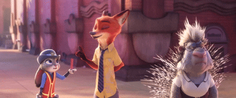

[](https://dar.dub-demopage.workers.dev)

# Dataset

We provide a sample of the DAR-Animation Dataset for reference. The complete set of annotations and high-dimensional feature vectors  for the DAR-Animation Dataset (~120 hours, 100 movies) will be fully open-sourced upon the formal publication of our work.

<details>
<summary><b>🎬 Click to view the complete list of 100 movies</b></summary>
<ol>
<li><i>The Boss Baby</i></li>
<li><i>The Boss Baby 2</i></li>
<li><i>Brave</i></li>
<li><i>Cloudy with a Chance of Meatballs</i></li>
<li><i>Cloudy with a Chance of Meatballs 2</i></li>
<li><i>Coco</i></li>
<li><i>The Croods</i></li>
<li><i>The Croods 2</i></li>
<li><i>How to Train Your Dragon</i></li>
<li><i>How to Train Your Dragon 2</i></li>
<li><i>How to Train Your Dragon 3</i></li>
<li><i>Frozen</i></li>
<li><i>Frozen II</i></li>
<li><i>The Incredibles</i></li>
<li><i>Incredibles 2</i></li>
<li><i>Inside Out</i></li>
<li><i>Inside Out 2</i></li>
<li><i>Meet the Robinsons</i></li>
<li><i>Moana</i></li>
<li><i>Wreck-It Ralph</i></li>
<li><i>Ralph Breaks the Internet</i></li>
<li><i>Tangled</i></li>
<li><i>Tinker Bell</i></li>
<li><i>Tinker Bell and the Lost Treasure</i></li>
<li><i>Tinker Bell and the Great Fairy Rescue</i></li>
<li><i>Toy Story</i></li>
<li><i>Toy Story 2</i></li>
<li><i>Toy Story 3</i></li>
<li><i>Toy Story 4</i></li>
<li><i>Up</i></li>
<li><i>Zootopia</i></li>
<li><i>Abominable</i></li>
<li><i>Sing</i></li>
<li><i>Sing 2</i></li>
<li><i>Despicable Me</i></li>
<li><i>Despicable Me 2</i></li>
<li><i>Despicable Me 3</i></li>
<li><i>Despicable Me 4</i></li>
<li><i>The Secret Life of Pets</i></li>
<li><i>The Secret Life of Pets 2</i></li>
<li><i>Antz</i></li>
<li><i>Bee Movie</i></li>
<li><i>Big Hero 6</i></li>
<li><i>Bolt</i></li>
<li><i>A Bug's Life</i></li>
<li><i>Captain Underpants: The First Epic Movie</i></li>
<li><i>Cars</i></li>
<li><i>Cars 2</i></li>
<li><i>Cars 3</i></li>
<li><i>Chicken Little</i></li>
<li><i>Elemental</i></li>
<li><i>Encanto</i></li>
<li><i>Finding Dory</i></li>
<li><i>Finding Nemo</i></li>
<li><i>Flushed Away</i></li>
<li><i>Home</i></li>
<li><i>Kung Fu Panda</i></li>
<li><i>Kung Fu Panda 2</i></li>
<li><i>Kung Fu Panda 3</i></li>
<li><i>Kung Fu Panda 4</i></li>
<li><i>Lightyear</i></li>
<li><i>Luca</i></li>
<li><i>Madagascar</i></li>
<li><i>Madagascar: Escape 2 Africa</i></li>
<li><i>Madagascar 3: Europe's Most Wanted</i></li>
<li><i>Penguins of Madagascar</i></li>
<li><i>Megamind</i></li>
<li><i>Monsters Inc</i></li>
<li><i>Monsters University</i></li>
<li><i>Monsters vs. Aliens</i></li>
<li><i>Mr. Peabody & Sherman</i></li>
<li><i>Onward</i></li>
<li><i>Over the Hedge</i></li>
<li><i>Puss in Boots</i></li>
<li><i>Puss in Boots: The Last Wish</i></li>
<li><i>Ratatouille</i></li>
<li><i>Raya and the Last Dragon</i></li>
<li><i>Rise of the Guardians</i></li>
<li><i>Shark Tale</i></li>
<li><i>Shrek</i></li>
<li><i>Shrek 2</i></li>
<li><i>Shrek the Third</i></li>
<li><i>Shrek Forever After</i></li>
<li><i>Soul</i></li>
<li><i>The Bad Guys</i></li>
<li><i>The Good Dinosaur</i></li>
<li><i>Trolls</i></li>
<li><i>Trolls World Tour</i></li>
<li><i>Turbo</i></li>
<li><i>Turning Red</i></li>
<li><i>Minions</i></li>
<li><i>Minions: The Rise of Gru</i></li>
<li><i>The Mitchells vs. the Machines</i></li>
<li><i>Wish</i></li>
<li><i>Strange World</i></li>
<li><i>Migration</i></li>
<li><i>Spies in Disguise</i></li>
<li><i>Ferdinand</i></li>
<li><i>Epic</i></li>
<li><i>Smallfoot</i></li>
</ol>
</details>

```
cd Dataset/data/
dataset.json

cd movies/example
example_dataset.json
```

## 🛠️ Data Preprocessing

### 1) Auto-detect and Insert New Scenes 

Run the automated script to detect the number of existing scenes in `XXX_dataset.json` and automatically generate a template for the next scene.

- `python auto_insert_scene.py`

### 2) Scene Video Extraction 

Extract complete scene clips from the original movie based on the timestamps defined in the JSON.

- `python scene.py`

### 3) Audio Denoising and Background Music Removal 

To eliminate the interference of movie background music and sound effects on model training, we use the **UVR-MDX-NET-Voc_FT** model to process the raw materials.

- `python preprocess.py`

### 4) Text Annotation and Timestamp Acquisition 

We provide the following two flexible options for obtaining the dialogue and exact timestamps corresponding to the video:

1. For materials with officially proofread subtitles, SRT files can be parsed directly.
2. For materials without SRT files, or for custom data construction, we provide an alternative method:
   Use **Faster-Whisper-large-v3** for high-precision transcription and enable Voice Activity Detection to ensure timestamps exclude silent parts.

- `python preprocess_txt.py`

### 5) Manual Correction of Characters and Faces 

You need to manually open `XXX_dataset.json` and verify the following information against the video footage:

- **Character ID**: Change "Unknown" to the actual character.
- **Face Detection**: Confirm whether the character's face is in the frame during that line of dialogue.
- **Scene Description**: Background description of the scene in the clip, as well as a description of the characters in the scene.
- **Character Voice Timbre**: Manually insert the character's voice timbre for the scene.

### 6) Audio and Video Stabilization Slicing 

Run `preprocess_wav.py` to physically cut the audio and video for each annotated line of dialogue, generating the final training units.

- `python preprocess_wav.py`

### 7) Emotion VAD Feature Tagging 

Use the **MERaLiON-SER** model to assist in annotating the Valence/Arousal/Dominance values of the audio.

- `python preprocess_VAD.py`

### 8) Director Arc Extraction 

For the training set, use the **Qwen3-Omni** multimodal large model to comprehensively analyze the video footage, audio track, and contextual plot of the entire scene to generate standardized guidance instructions.

- `python preprocess_arc.py`

### ⚠️⚠️⚠️ Be sure to manually verify the correctness of the data annotations after completion.

### 📁 Directory Structure Reference

```
movies/
├── XXX/                  # Movie dataset directory
│   ├── XXX_dataset.json  # Core annotation file
│   ├── Scenes/           # Complete scene clips
│   ├── wavs/             # Final audio segments (24kHz)
│   └── video/            # Final video segments (25fps)
└── preprocess_*.py       # Automated processing scripts
```


## 🛠️ Offline Feature Extraction

To improve training efficiency and reduce VRAM usage, we adopt an **Offline Extraction** strategy. Before training begins, all multimodal materials will be mapped into high-dimensional feature vectors and saved in `.npy` format.

### 1) Multimodal Affective Encoding

Use large language models and encoders to extract deep description features of the dialogue semantics and video frames.

- **Models**: **Emotion-RoBERTa-Large** & **VideoLLaMA3**
- **Extracted Content**:
  - **Textual Sentiment** & **Director Guidance**: Use Emotion-RoBERTa-Large to extract semantic-level emotional representations of the dialogue text and director's instructions.
  - **Environment Atmosphere**: Use VideoLLaMA3 to analyze the environmental atmosphere in the video, generate a description, and map it into an emotion vector.
  - **Facial Affect**: Use VideoLLaMA3 to deeply analyze the character's facial micro-expressions, generate a description, and map it into an emotion vector.
-  `python Text_emos.py`

### 2) Speaker Timbre and Acoustic Emotion 

Extract the character's inherent timbre features and the emotional expressiveness vectors in the speech.

- **Models**: **CAMPPlus** & **Wav2Vec2-Bert** & **UnifiedVoice**
- **Extracted Content**:
  - **Speaker Timbre**: Extract speaker timbre embeddings based on the CAMPPlus module inside IndexTTS2.
  - **Acoustic Sentiment**: Use Wav2Vec2-Bert 2.0 to extract the deep semantic hidden states of the audio, and then input them into the UnifiedVoice module of IndexTTS2 to extract acoustic emotion vectors.
-  `python Timbre.py`

### 3) Frame-Level Visual Feature Extraction

Extract frame-level lip movements and facial dimensional emotions through pixel-level tracking technology.

- **Models**: **SAM 2.1** & **S3FD** &  **EmoNet** & **ResNet-18** 
-  **Key Technology**: Use **SAM 2.1** for full-video pixel-level isolation to ensure features are extracted only from the target character, eliminating background interference.

| Input Video |  | Output Video |
| :---: | :---: | :---: |
|  | **SAM2** <br> ➔ |  |

- **Extracted Content**:
  - **Lip Embedding**: Lip movement features based on S3FD + lrw_resnet18_mstcn_video.
  - **EmoVA Facial Affect**: Facial dimensional emotion vectors based on S3FD + EmoNet.
- `python EmoVA_Lipreading.py`

### 📁 Directory Structure Reference
```
preprocessed_data/
├── features/                
│   ├── VA_features/             # EmoVA Facial Affect Vectors
│   ├── arc/                     # Director Guidance Vectors
│   ├── extrated_embedding_gray/ # Lip Embeddings Vectors
│   ├── face/                    # Facial Affect Vectors
│   ├── scene/                   # Environment Atmosphere Vectors
│   ├── text/                    # Textual Sentiment Vectors
│   ├── emotion/                 # Acoustic Sentiment Vectors
│   └── timbre/                  # Speaker Timbre Vectors
└── wavs/                        # Speech files
```


# Dependencies

```
pip3 install -r requirements.txt
```

# Training

We only need to train the two stages of Actor：

**Macro-Contextual Level (EmotionGateformer）** 

```
python EmotionGateformer/train.py --config EmotionGateformer/Configs/Config.yml
```

 **Micro-Performance Level (Dubber)**:  Adopts ProDubber's two-stage training architecture

```
python ProDubber/train_first.py -p Configs/config_stage1.yml
python ProDubber/train_second.py -p Configs/config.yml
```


# ⚖️ Disclaimer

* **Research Purpose Only**: This dataset is provided for non-commercial, academic research purposes only. 

* **Copyright**: All original movie materials (visuals, audio, and characters) are the intellectual property of their respective studios (Disney, Pixar, DreamWorks, etc.). The authors do not own the raw multimedia content.

* **Compliance**: Users are responsible for complying with local copyright laws when using this dataset. 

* **No Original Movie Distribution**: To strictly comply with copyright laws, the original, full-length movie files will NOT be distributed. We only provide  annotations, and multimodal feature vectors intended for academic research.

  
